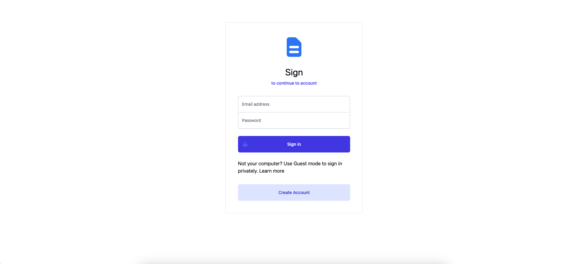
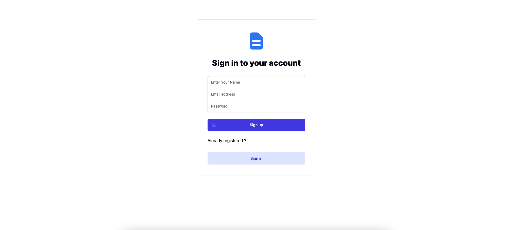
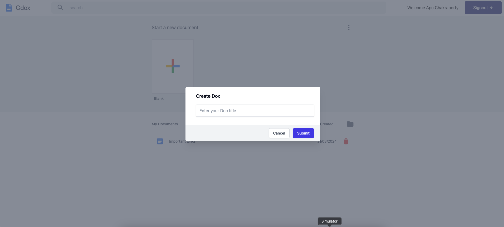
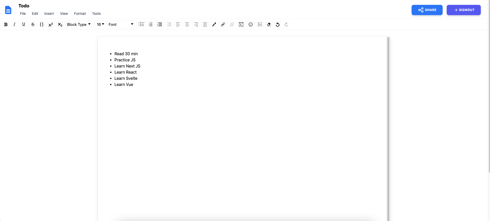
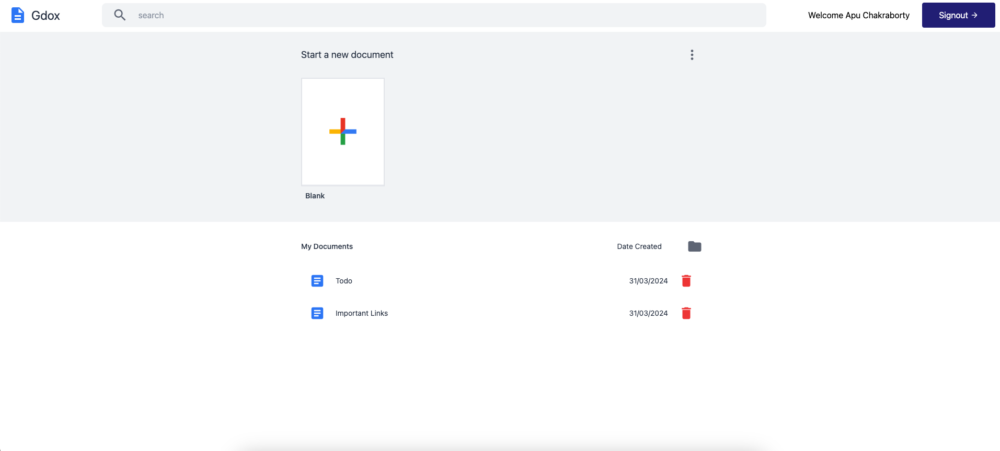

# Project Name

Description of your project.

## Features

### Sign In

Description of sign in functionality.

### Sign Up

Description of sign up functionality.

### Create Document

Description of create document functionality.

### Edit Document

Description of edit document functionality.

### List Document

Description of list document functionality.

### Landing Page

Description of landing page.

## Getting Started

Instructions on how to get started with the project.

## Installation

Steps to install and run the project locally.

## Usage

Instructions on how to use the project.
